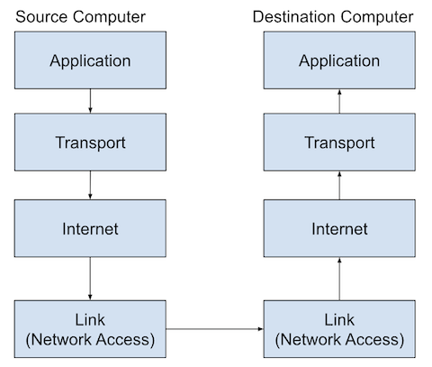

# The TCP/IP Model 

The model has 4 layers 

	

## Application 

Protocols in this layer include:

- www(World Wide Web)
- Email
- V.OI.P. (phone calls)
- SMS (texting)
- IRC

## Transport

Protocols in this layer include:

- TCP
- UDP

## Internet

Protocols in this layer include:

- IP adresses

## Link (Network Acess)

Protocols in this layer include:

- Wifi
- Bluetooth 
- LTE (cell service)
- Ethernet (physical wire)
