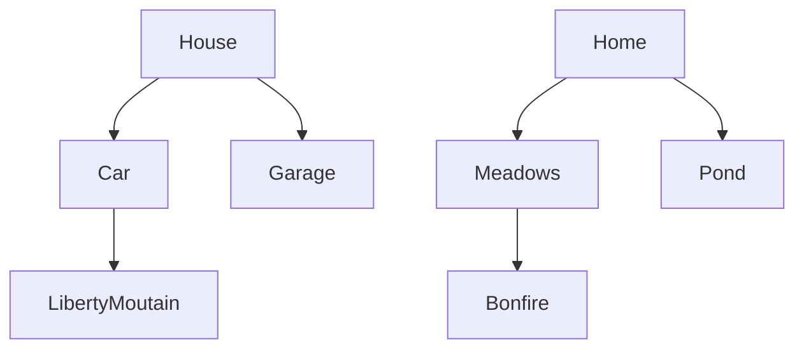

# Chris Needs Coffee

## Setting

This game takes place at a cabin in Pennsylvania

## Map

The player starts at the House they are told they have their ski gear on and are told they need to find their ski. They can explore, but must eventually make their way to the Garage

## Story

When the user gets to the Garage, they find the ski gear in the Garage and have to take it to the Car

There is only one way to win and survive. All other options end in a different type of death (Drowning, Mauled, Burned, Crushed, or in a Car Crash). 

## Global Variables

The most important variable is
`haveskis` this boolean tracks progress in the
story. Depending on this variable, the car will give you a hidden option (the only option to survive)

<!---I also have a varible `havemeat` which can be found in the bonfire area, if used back in the meadows, you can survive the bear attack and the bear will lead you to the skis --->

I have a little HUD map, and use a bunch of 
boolean variables to control which
rooms the player has discovered. A map is only displayed after the user
visits it.
